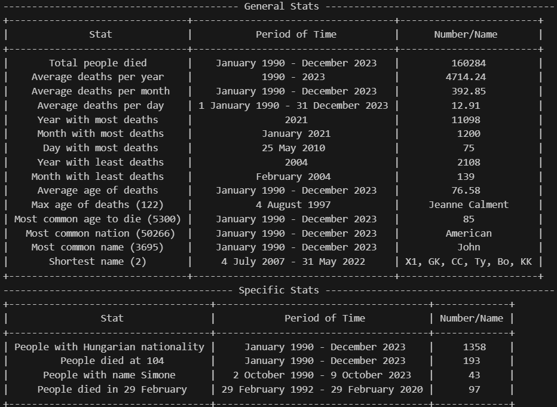

# WikiDeath
 
Programma che crea un database con tutte le morti celebri listate su wikipedia nelle pagine Deaths_in_Month_Year dal Gennaio 1990 fino a Dicembre 2023. Le morti vengono divise per giorno e di ogni persona viene salvato nome, età di morte e nazionalita (nel caso in cui non siano disonibili la persona viene ignorata). 
Una volta creato il database vengono calcolate alcune statistiche, sia generali che specifiche, sulle morti ad esempio anno con più morti, età media di morte, ecc... 
Queste statistiche vengono printate in una tabella tramite il pacchetto prettytable.
### Esempio di output
